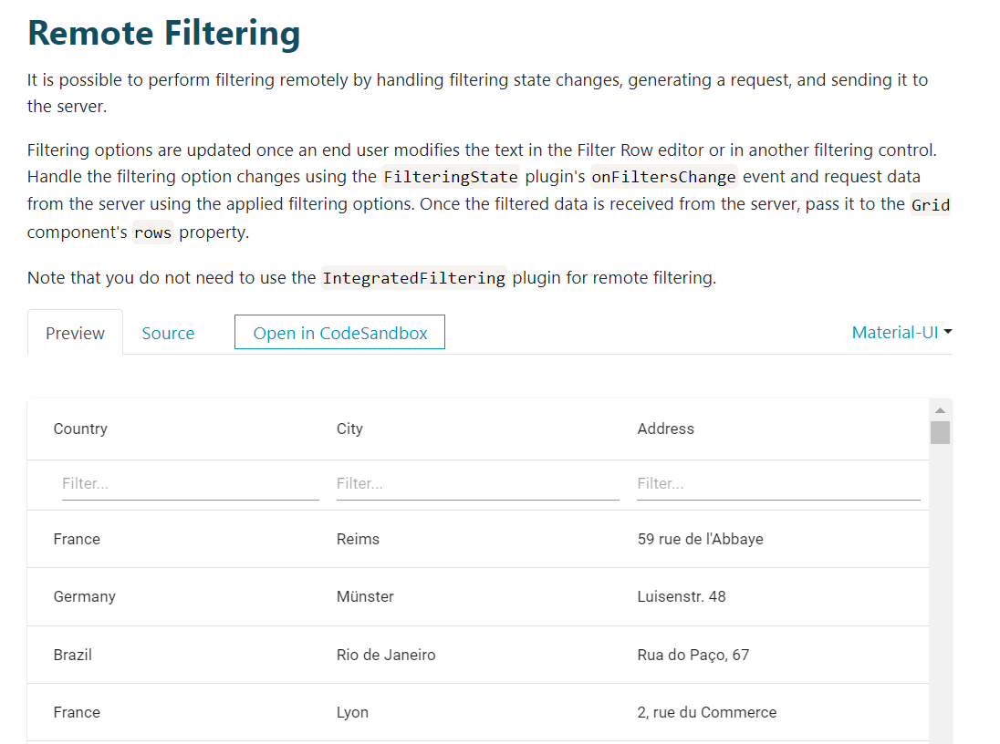
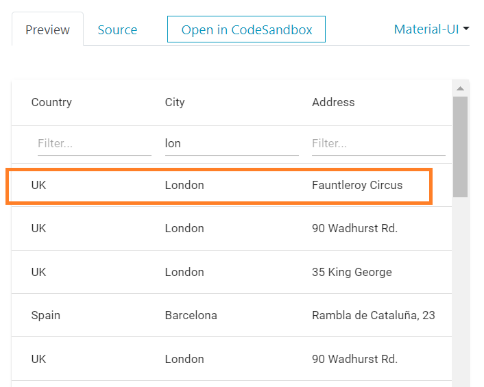
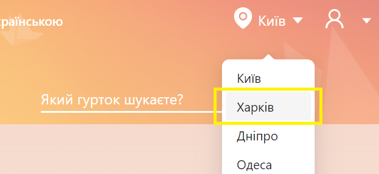
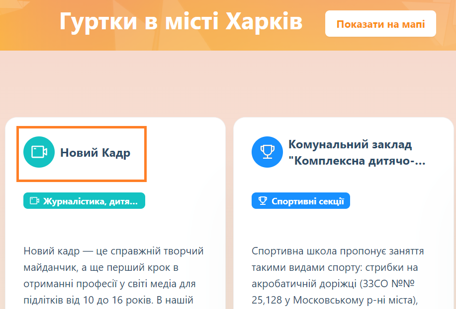
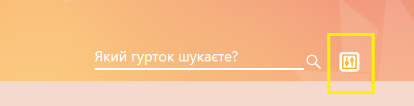
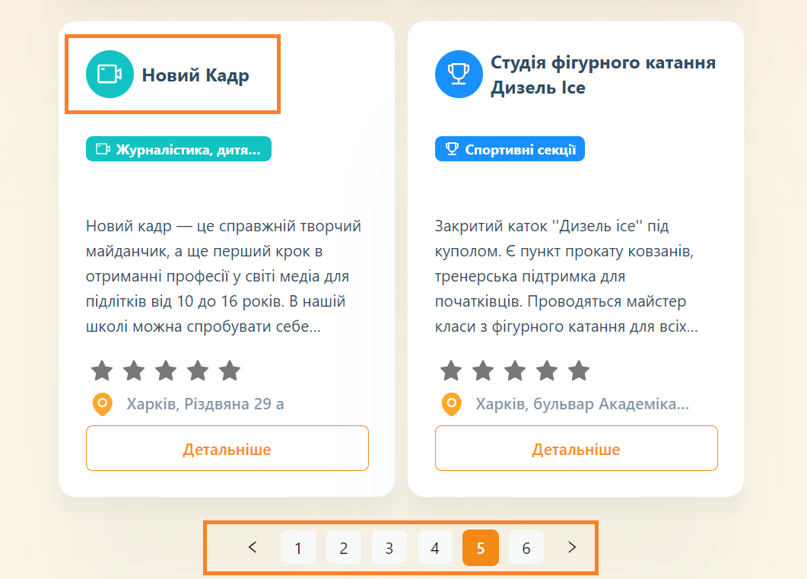
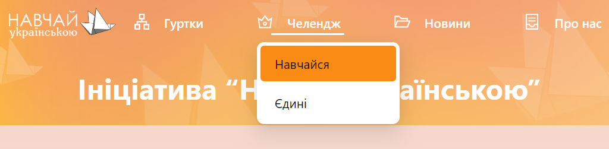
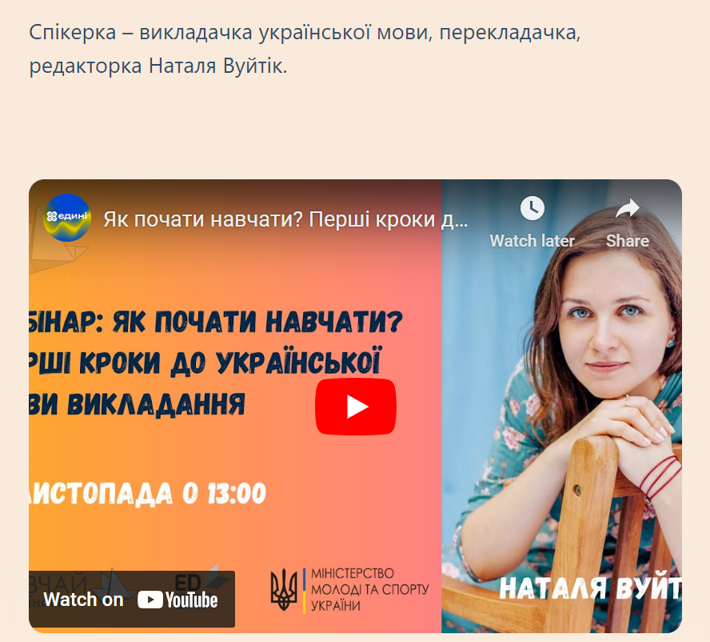
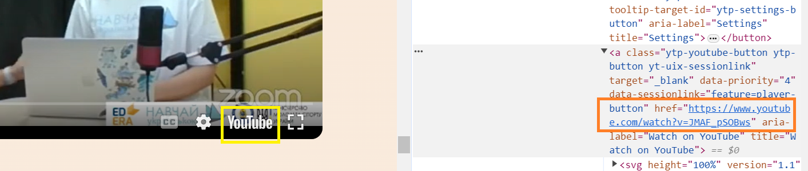

## Task 1

1. Requirement: Check the data filtering functionality in the Remote Filtering table. Prepare a test script
   
   Make changes to the RemoteFilteringTest class.
2. Go to the page by the link
   https://devexpress.github.io/devextreme-reactive/react/grid/docs/guides/filtering/
3. Scroll the browser to the "Remote Filtering" item.
4. Switch to the data table frame.
5. In the search field of the City column, type "lon".
6. In the first line you should get: "Country: UK", "City: London", "Address: Fauntleroy Circus"
   

## Task 2

1. Requirement: Check the advanced club search functionality. Prepare a test script.  Make changes to the clubSearchTest class.
2. Go to the page by the link
   http://speak-ukrainian.eastus2.cloudapp.azure.com/dev/
3. Select the city "Харків".
   
4. Check the presence of the "Новий Кадр" club on the page.
   
5. Open advanced search.
   
6. Find the "Новий Кадр" club on page 5.
   

## Task 3 (additional, optional)

1. Requirement: Check the correctness of the first youtube link in the "Навчайся" challenge. Prepare a test script.
   Make changes to the ChallengeTest class.
2. Go to the page by the link
   http://speak-ukrainian.eastus2.cloudapp.azure.com/dev/
3. Select the "Навчайся" challenge.
   
4. Scroll down the page to the video "Спікерка – викладачка української мови, перекладачка, редакторка Наталя Вуйтік".
   
5. Switch to the video frame.
6. Start the video.
7. Check the correctness of the link on the video "https://www.youtube.com/watch?v=JMAF_pSOBws".
   

> Record a short video (3-5 minutes) demonstrating your code functionality and test execution, then post it on your YouTube channel.
The report should include a link to GitHub and a link to the video.
